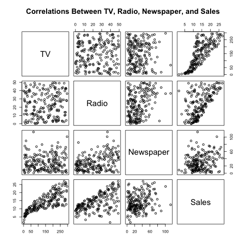

# Abstract

This report will reproduce the findings concerning the relationship between TV, Radio, and Newspaper Budgets and Sales from the Advertising.csv dataset, from Chapter 3.2 of an _An Introduction to Statistical Learning_ by Gareth James, Daniela Witten, Trevor Hastie and Robert Tibshirani. 

# Introduction

The purpose of this report is to improve overall sales by determining whether or not sales can be predicted by TV, Radio, and or Newspapers budgets. To do this, the relationship between these variables will be explored through simple linear regression, as well as multiple linear regression. 

# Data

The Advertising.csv dataset contains the TV, Radio, and Newspaper budgets in thousands of dollars, as well as sales in thousands of units, for 200 different markets. In this report, only the TV budgets and sales will be looked at from this dataset. 

# Methodology

We assume a roughly linear relationship between Sales and TV Budget, Sales and Radio Budget, and Sales and Newspaper Budget for the Advertising dataset, and so will use simple linear models to illustrate this relationships:

> Sales = $\beta_0$ + $\beta_1$ TV
>
> Sales = $\beta_0$ + $\beta_1$ Radio
>
> Sales = $\beta_0$ + $\beta_1$ Newspaper

$\beta_0$ and $\beta_1$ represent the intercept and slope of the equation, respectively. To estimate these unknown coefficients, we can minimize the least squares criterion. 

For these simple linear regressions, first the summaries and histograms for the distributions of the variables are looked at individually. Then the coefficients are estimated, the standard error of these estimates is calculated, and then a t-test is performed to determine the significance of these values. In addition, the residual standard error and R-squared values can be calculated to determine how well the model fits the data. 

---

We will also create multiple linear regression model of the form 

> Sales = $\beta_0$ + $\beta_1$ TV + $\beta_2$ Radio + $\beta_3$ Newspaper

to determine the effect of multiple predictors, TV, Radio, and Newspaper budget, on sales. 

As with simple linear regression, the unknown coefficients are estimated using the least squares approach, in which we select values that minimize the residual sum of squares. A correlation matrix will also give us insight into the relationship between the variables. 

To determine if at least one of TV, Radio, and Newspaper budget has an effect on sales, we will find the F-statistic of the model. Like before, to determine how well the model fits the data, the residual standard error and R-squared values will also be calculated. 

# Results

```{r include=FALSE}
install.packages("pander", repos="http://cran.rstudio.com/")
library(pander)
load("../data/regression.Rdata")
load("../data/correlation-matrix.RData")
```

\begin{center}
  Table 1: Estimating the Regression Coefficients for Sales Onto TV
\end{center}
```{r, echo=FALSE}
pander(tv_reg_summary, type = 'grid', caption = "Assessing the Fit of the Sales Onto TV Model")
```

\begin{center}
  Table 3: Estimating the Regression Coefficients for Sales Onto Radio
\end{center}
```{r, echo=FALSE}
pander(radio_reg_summary, type = 'grid', caption = "Assessing the Fit of the Sales Onto Radio Model")
```

\begin{center}
  Table 5: Estimating the Regression Coefficients for Sales Onto Newspaper
\end{center}
```{r, echo=FALSE}
pander(news_reg_summary, type = 'grid', caption = "Assessing the Fit of the Sales Onto Newspaper Model")
```

The regression coefficients for the Sales onto TV model are estimated in Table 1 above, and we can see that $\beta_0$ and $\beta_1$ are estimated to be `r I(tv_reg_summary$coef[, "Estimate"])` respectively. This means for an increase of $1000 in TV budget, we will see about an additional `r I(unname(tv_reg_summary$coef[, "Estimate"][2]) * 1000)` units sold. We can also see that the p-value from performing the t-test is extremely low, indicating that this is a statistically significant value and that there is strong evidence that there is a relationship between TV Budget and Sales. 

Looking at Table 2, we see that the Sales onto TV model has an R-squared value of `r I(tv_reg_summary$r.squared)`, which indicates a majority of the variability in Sales can be explained by TV Budget, and that the relationship between TV Budget and Sales is roughly linear. The residual standard error (RSE) value of `r I(tv_reg_summary$sigma)` also supports these statements, as it is not too large. 

Similarly for the Sales onto Radio model, in Table 3, we can see that $\beta_0$ and $\beta_1$ are estimated to be `r I(radio_reg_summary$coef[, "Estimate"])` respectively. This means for an increase of $1000 in Radio budget, we will see about an additional `r I(unname(radio_reg_summary$coef[, "Estimate"][2]) * 1000)` units sold. We can also see that the p-value from performing the t-test is also extremely low, indicating that this is a statistically significant value and that there is strong evidence that there is a relationship between Radio Budget and Sales. 

Looking at Table 4, we see that the Sales onto Radio model has an R-squared value of `r I(radio_reg_summary$r.squared)`, which indicates some of the variability in Sales can be explained by Radio Budget. The residual standard error (RSE) value of `r I(radio_reg_summary$sigma)` also supports this statement, as it is not too large but also not too small either. 

Finally for the Sales onto Newspaper model, in Table 5, we can see that $\beta_0$ and $\beta_1$ are estimated to be `r I(news_reg_summary$coef[, "Estimate"])` respectively. This means for an increase of $1000 in Newspaper budget, we will see about an additional `r I(unname(news_reg_summary$coef[, "Estimate"][2]) * 1000)` units sold. We can also see that the p-value from performing the t-test is also low, indicating that this is a statistically significant value and that there is evidence that there is a relationship between Newspaper Budget and Sales. 

Looking at Table 6, we see that the Sales onto Newspaper model has an R-squared value of `r I(news_reg_summary$r.squared)`, which indicates almost none of the variability in Sales can be explained by Newspaper Budget. The residual standard error (RSE) value of `r I(news_reg_summary$sigma)` also supports this statement, as it is not very small. 

---

\begin{center}
  Table 7: Least Squares Regression Coefficient Estimates for Sales Onto TV, Radio, and Newspaper
\end{center}
```{r, echo=FALSE}
pander(mult_regression_summary, type = 'grid', caption = "Assessing the Fit of the Multiple Regression Model")
```

In Table 8, we can see that the multiple linear regression model seems to fit the data well as the R-squared value is `r I(mult_regression_summary$r.squared)`, which indicates most of the variability in Sales can be explained by these three budgets. In addition, the residual standard error is quite low, with a value of `r I(mult_regression_summary$sigma)`, which also supports this statement. 

We also calculate the F-statistic using equation 3.23 in the text, and obtain the value `r I(unname(mult_regression_summary$fstatistic[1]))`. Since this is a very high value, this supports the above statement as we can conclude that there is strong evidence that there is a relationship between Sales and at least one of these three budgets. 

Looking at Table 7, we are better able to see the individual effects of each of the budgets on sales. As with the simple linear regression, both the coefficients for TV and Radio budgets have extremely low p-values, so there is strong evidence that there is a relationship between these budgets and sales. However with the multiple linear regression, we now see that the coefficient for Newspaper has a high p-value of `r I(unname(mult_regression_summary$coefficients[, 4][4]))`, indicating that even though the simple linear regression found Newspaper budget to be statistically significant, the multiple linear regression model finds strong evidence for us to accept the null hypothesis that there is no relationship between Newspaper budget and Sales.

To explain why the simple linear regression found that there was strong evidence for a relationship between Newspaper budget and Sales but the multiple linear regression is finding the opposite, we can take a look at the correlation matrix for these four variables. 


\begin{center}
  Figure 1: Correlation Matrix of Sales, TV, Radio, and Newspaper
\end{center}

Looking at Figure 1, we can easily see that TV and Sales are correlated, and that Radio and Sales are correlated as well. However, Newspaper and Sales do not seem to have a clear strong relationship. We can also see though that Newspaper and Radio seems to have slight relationship, albeit a weak one. Since they are somewhat correlated, that means that an increase in Radio budget also tends to have an increase in Newspaper budget. We already know that Radio budget does have an effect on sales, so that's why it appeared that Newspaper budget had an effect on sales, while in reality, individually Newspaper budget and Sales have almost no correlation. 

# Conclusions

Based on our results, using the multiple linear regression F-statistic, we could see that at least one of TV, Radio, and Newspaper budgets are useful in predicting the response, Sales. Looking at the p-values for the coefficient estimates for these predictors, we see that two of our predictors, TV and Radio budget, are useful in predicting Sales. Newspaper budget, on the other hand, has a very low correlation with Sales. The low residual standard error and high R-squared value tell us that the multiple linear regression model is a good fit for our data. Since it is a good fit, our prediction for Sales will be relatively accurate given TV, Radio and Newspaper budgets. 
