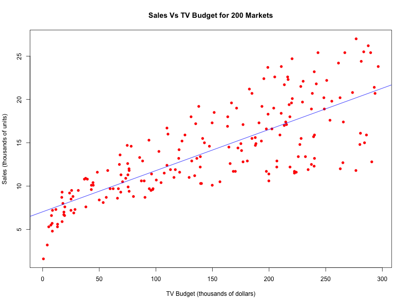

# Abstract

This report will reproduce the findings concerning the relationship between TV Budget and Sales in the Advertising.csv dataset, from Chapter 3.1 of an _An Introduction to Statistical Learning_ by Gareth James, Daniela Witten, Trevor Hastie and Robert Tibshirani. 

# Introduction

The purpose of this report is to improve overall sales by determining whether or not sales can be predicted by TV budget. To do this, the relationship between these two variables will be explored through simple linear regression. 

# Data

The Advertising.csv dataset contains the TV, Radio, and Newspaper budgets in thousands of dollars, as well as sales in thousands of units, for 200 different markets. In this report, only the TV budgets and sales will be looked at from this dataset. 

# Methodology

We assume a roughly linear relationship betwen Sales and TV Budget for the Advertising dataset, and so will use a simple linear model to illustrate this relationship:

Sales = $\beta_0$ + $\beta_1$ TV

$\beta_0$ and $\beta_1$ represent the intercept and slope of the equation, respectively. To estimate these unknown coefficients, we can minimize the least squares criterion. 

First the summaries and histograms for the distributions of TV budget and Sales are looked at individually. Then the coefficients are estimated, the standard error of these estimates is calculated, and then a t-test is performed to determine the significance of these values. In addition, the residual standard error and R-squared values can be calculated to determine how well the model fits the data. 


# Results

```{r include=FALSE}
install.packages("pander", repos="http://cran.rstudio.com/")
library(pander)
load("../data/regression.Rdata")
```

\begin{center}
  Table 1: Estimating the Regression Coefficients
\end{center}
```{r, echo=FALSE}
pander(reg_summary, type = 'grid', caption = "Assessing the Fit of the Model")
```

The regression coefficients are estimated in Table 1 above, and we can see that $\beta_0$ and $\beta_1$ are estimated to be `r I(reg_summary$coef[, "Estimate"])` respectively. This means for an increase of $1000 in TV budget, we will see about an additional 47.5 units sold. We can also see that the p-value from performing the t-test is extremely low, indicating that this is a statistically significant value and that there is strong evidence that there is a relationship between TV Budget and Sales. 

Looking at Table 2, we see that the model has an R-squared value of `r I(reg_summary$r.squared)`, which indicates a majority of the variability in Sales can be explained by TV Budget, and that the relationship between TV Budget and Sales is roughly linear. The residual standard error(RSE) value of `r I(reg_summary$sigma)` also supports these statements, as it is greater than 1. 


\begin{center}
  Figure 1: Scatterplot of Sales Vs TV Budget with Fitted Regression Line
\end{center}

Looking at Figure 1, we can see that the fitted regression line roughly encompasses most of the data points, however for low TV budgets, the line does not fit the data as well. The values also tend to fan out as TV budget increases, so while the relationship between the two variables seems to be approximately linear, there may be other non-linear models that could provide a better fit. 

# Conclusions

Based on our results, we see a very low p-value after performing a t-test to determine whether there's a relationship between Sales and TV Budget, which indicates that there is strong evidence that there is a relationship. The R-squared and RSE values indicate that there is a roughly linear relationship between these two variables. The scatterplot supports this claim, also giving us additional information that the fitted model is not as accurate for low TV budgets. Therefore we can see that we can use the model to roughly predict Sales based on TV Budget, as long as TV Budget is above a certain value (approximately at least 10 thousand dollars). 
